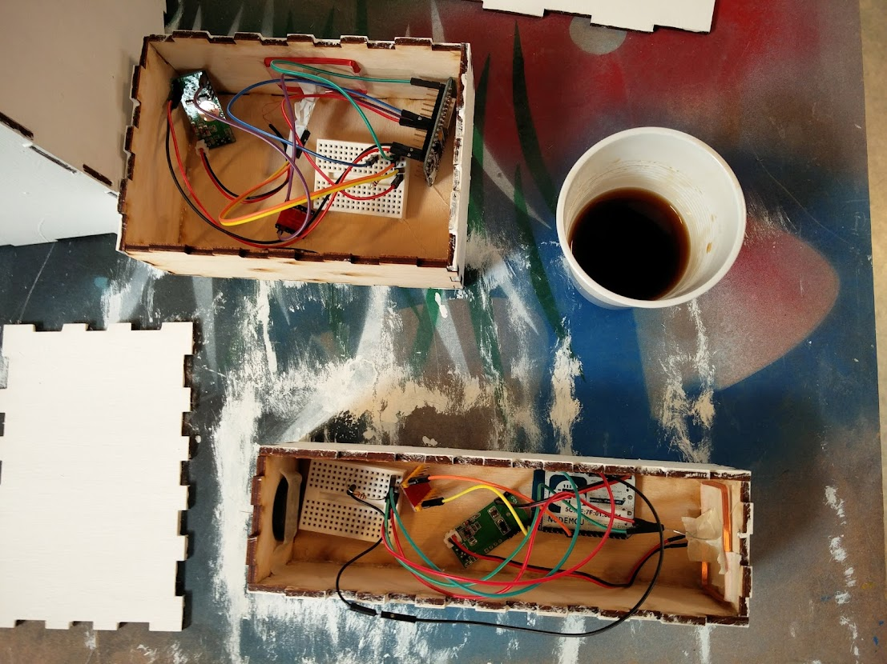
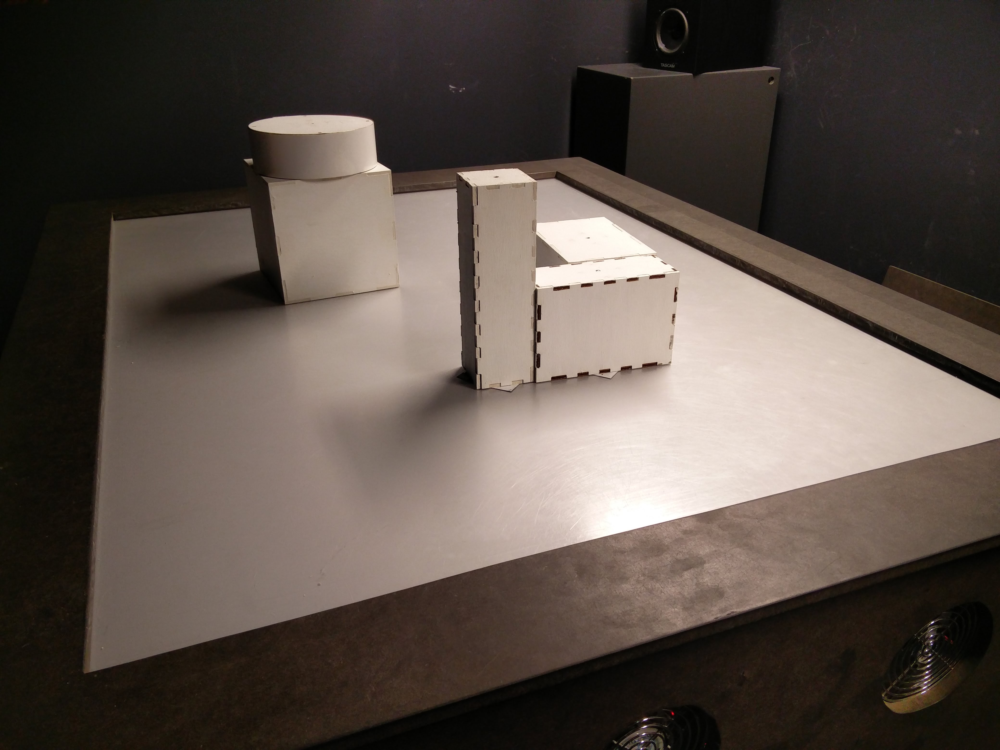
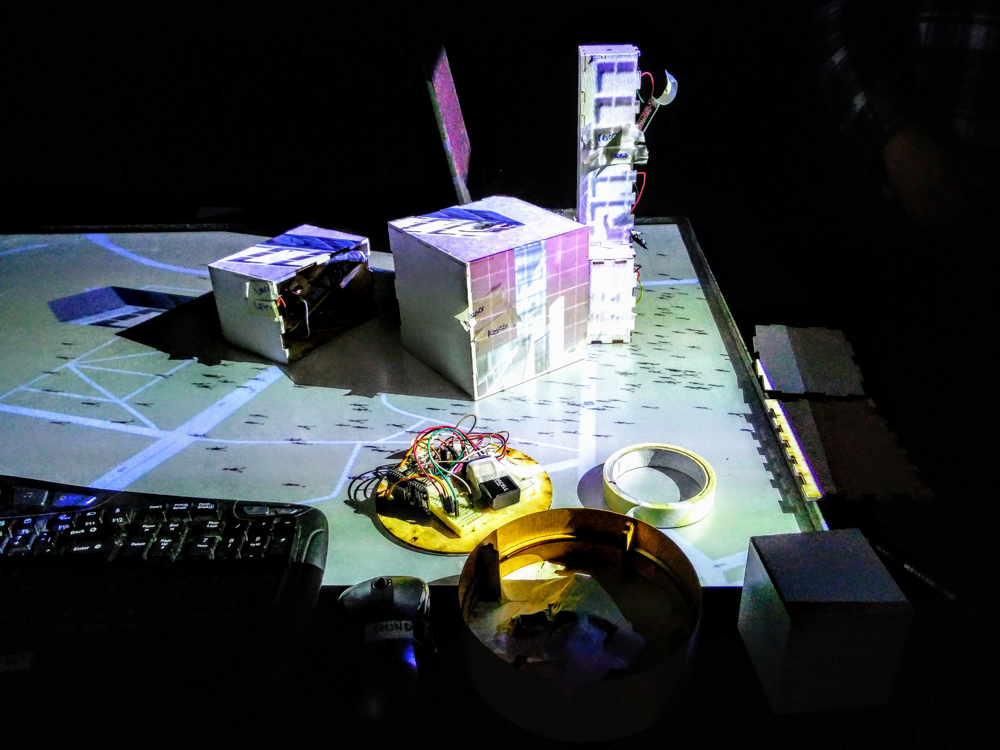
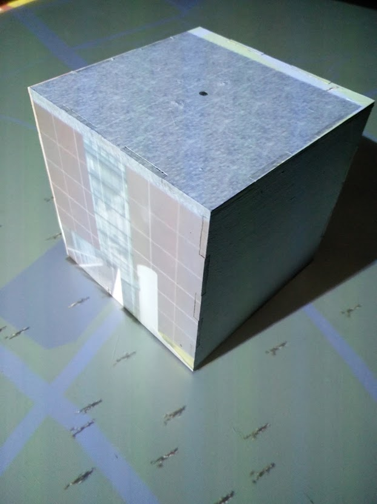
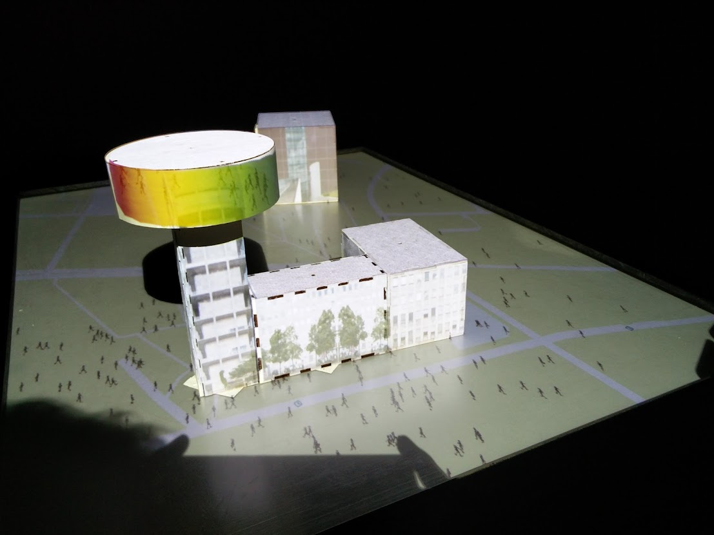

# 3D Interaction
Many interactive tables work by placing a infrared camera beneath the glass-plastic surface, to track activity on the table surface. 3D-researchers at Aarhus University have augmented the interactive table by projecting graphics onto objects on the surface, by syncing projectors and the camera tracking. In this project, we investigated projecting graphics onto objects stacked on other objects, using RFID sensors. 

### Hardware with RFID reader 

### Objects before projection

### Calibrating the graphics

### Model of ARoS Museum in Aarhus

### Signature rainbow-roof of ARoS placed on top of the town hall of Aarhus

